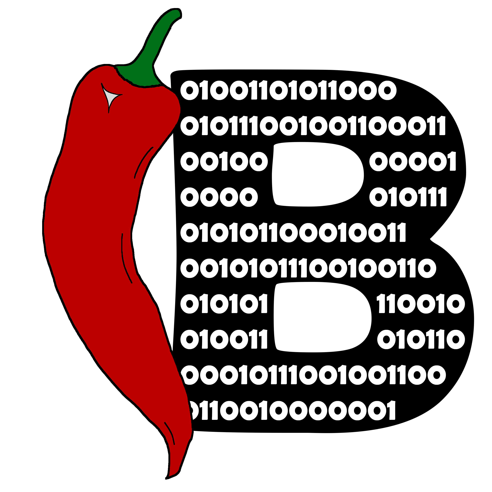

<p align="center">
  
  <h3 align="center">Spice Programming Language</h3>
  <p align="center">Compiler and standard library for the Spice programming language.</p>
  <p align="center">
    <a target="_blank" href="https://github.com/spicelang/spice/releases/latest"></a>
    <a target="_blank" href="https://hub.docker.com/r/chillibits/spice"></a>
    <a target="_blank" href="./.github/workflows/ci-go.yml"></a>
	<a target="_blank" href="./.github/workflows/ci-cpp.yml"></a>
	<a target="_blank" href="./.github/workflows/codeql-analysis.yml"></a>
    <a target="_blank" href="https://makeapullrequest.com"></a>
    <a target="_blank" href="./LICENSE.md"></a>
  </p>
</p>

---

This is the home repo of the Spice programming language. Spice is a compiled language which sets a focus on performance and practicality. It is considered as a systems language, which means it is neither suitable for coding user interfaces nor any interface with the user, except cli tools. Spice supports cross-compilation to all target platforms, listed below.

If you like Spice, please consider a GitHub star! ⭐

|:warning: | The compiler of the Spice language is still in alpha stages and under development. Please note that code may behave differently in the future or even break due to the volatility of the compiler. |
|----------|:-------------------------------|

## Documentation
Please visit the documentation at [spicelang.com](https://www.spicelang.com).

## Grammar
The Spice grammar can be found [here](./src/grammar/Spice.g4) as a ANTLR grammar configuration file.

## Available target platforms
### Target architecture
- `aarch64`
- `amdgpu`
- `armv5`, `armv6`, `armv7`
- `avr`
- `bpf`
- `hexagon`
- `lanai`
- `mips`
- `msp430`
- `nvptx`
- `powerpc`
- `riscv`
- `sparc`
- `systemz`
- `webassembly`
- `x86`
- `x86_64`
- `xcore`

## CMake instructions for building LLVM (required for building Spice itself)
**Configure - Ninja:**
```sh
cmake -DCMAKE_BUILD_TYPE=Release -DCMAKE_C_COMPILER=gcc -DCMAKE_CXX_COMPILER=g++ -DCMAKE_CXX_FLAGS_RELEASE="-O2" -GNinja ../llvm
```

**Configure - MinGW Makefiles:**
```sh
cmake -DCMAKE_BUILD_TYPE=Release -DCMAKE_C_COMPILER=gcc -DCMAKE_CXX_COMPILER=g++ -DCMAKE_CXX_FLAGS_RELEASE="-O2" -G "CodeBlocks - MinGW Makefiles" ../llvm
```

**Build:**
```sh
cmake --build .
```

## Contribute to the project
If you want to contribute to this project, please ensure you comply with the [contribution guidelines](./CONTRIBUTING.md).

© ChilliBits 2021-2022