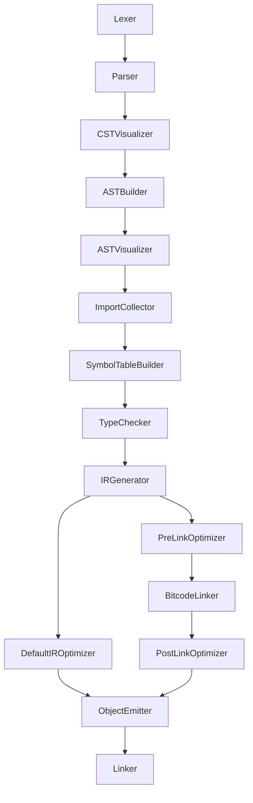

# Compile stages design document

In order to achieve "separation of concerns" the plan is, to re-organize the compiler structure. We want to separate
such things like semantic analysis and type checker.

## Overview

## Compile stages in detail

1.  **Lexer**  
    Input/Output: Text input -> Tokens  
    Note: Splits the source input into tokens (ANTLR)

2.  **Parser**  
    Input/Output: Tokens -> CST  
    Note: Parses tokens to a Concrete Syntax Tree (ANTLR)

3.  **CST Visualizer**  
    Input/Output: CST -> CST  
    Note: Prints the CST as JSON or Dot code.

4.  **AST Builder**  
    Input/Output: CST -> AST  
    Note: Transforms the Concrete Syntax Tree to an Abstract Syntax Tree, enriches it and executes concluding syntax checks.

5.  **AST Visualizer**  
    Input/Output: AST -> AST  
    Note: Prints the AST as JSON or Dot code.

6.  **Import Collector**  
    Input/Output: AST -> AST  
    Note: Checks, which other source file are imported by the current one. Registers external symbols. Process module attributes. 
    [here](./better-imports.md).

7.  **Symbol Table Builder**  
    Input/Output: AST -> AST  
    Note: Creates the symbol table without types and lifetimes

8.  **Type Checker**  
    Input/Output: AST -> AST  
    Note: Checks if all types match, performs type inference, fill types in symbol table

9.  **IR Generator**  
    Input/Output: AST -> IR  
    Additional used resources: Symbol Table  
    Note: Uses several helper modules to generate IR from the information of AST and Symbol Table.

10. **IR Optimizer**  
    Input/Output: IR -> IR  
    Note: Uses the stated optimization level to call the LLVM optimizer. In case of -O0, the IR Optimizer is not invoked.

11. **Object Emitter**  
    Input/Output: IR -> Object file  
    Note: Calls LLVM to emit an object file from the generated IR.

These stages are organized in classes, inheriting from the `CompilerPass` class. This class is responsible for holding
general information like references to the current source file, or the global resource manager.

When the compilation of a source file is triggered, it calls the stages one after another.

## Order of execution for multiple source files

Source file A imports B and C.

1. Lexer for A
2. Parser for A
3. CST Visualizer for A
4. AST Builder for A
5. AST Visualizer for A
6. Import Collector for A
   1. Trigger compilation of B
      1. Lexer for B
      2. Parser for B
      3. CST Visualizer for B
      4. AST Builder for B
      5. AST Visualizer for B
      6. Import Collector for B
   2. Trigger compilation of C
       1. Lexer for C
       2. Parser for C
       3. CST Visualizer for C
       4. AST Builder for C
       5. AST Visualizer for C
       6. Import Collector for C
7. Symbol Table Builder for B
8. Symbol Table Builder for C
9. Symbol Table Builder for A
10. Type Checker for B (prepare)
11. Type Checker for C (prepare)
12. Type Checker for A (prepare)
13. Type Checker for A (check)
14. Type Checker for B (check)
15. Type Checker for C (check)
16. IR Generator for B
17. IR Optimizer for B
18. Object Emitter for B
19. IR Generator for C
20. IR Optimizer for C 
21. Object Emitter for C 
22. IR Generator for A 
23. IR Optimizer for A 
24. Object Emitter for A

## Note for parallelization:

The last three steps (IR Generator, IR Optimizer, Object Emitter) are executed for every source file individually and
can be parallelized.