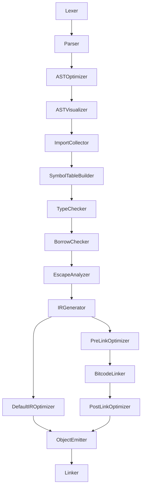

# Compile stages design document

In order to achieve "separation of concerns" the plan is, to re-organize the compiler structure. We want to separate
such things like semantic analysis and type checker.

## Overview

## Compile stages in detail

1.  **Lexer**  
    Input/Output: Text input -> Tokens  
    Note: Splits the source input into tokens (ANTLR)

2.  **Parser**  
    Input/Output: Tokens -> CST  
    Note: Parses tokens to a Concrete Syntax Tree (ANTLR)

3. **AST Optimizer**  
    Input/Output: AST -> AST  
    Note: Removes obviously unnecessary nodes like empty if-statements

4.  **AST Visualizer**  
    Input/Output: AST -> AST  
    Note: Prints the AST as JSON or Dot code.

5.  **Import Collector**  
    Input/Output: AST -> AST  
    Note: Checks, which other source file are imported by the current one. Registers external symbols. Process module attributes. 
    [here](./better-imports.md).

6.  **Symbol Table Builder**  
    Input/Output: AST -> AST  
    Note: Creates the symbol table without types and lifetimes

7.  **Type Checker**  
    Input/Output: AST -> AST  
    Note: Checks if all types match, performs type inference, fill types in symbol table

8. **Borrow Checker** (new component, maybe added in the future)  
    Input/Output: AST -> AST  
    Additional used resources: Symbol Table  
    Note: Checks if all variable accesses are valid, escape analysis, fill lifetimes in symbol table

9. **Escape Analyzer**  
    Input/Output: AST -> AST  
    Additional used resources: Symbol Table  
    Note: Checks, which variables escape their scopes and check if these variables are marked as heap-allocated by the programmer.

10. **IR Generator**  
    Input/Output: AST -> IR  
    Additional used resources: Symbol Table  
    Note: Uses several helper modules to generate IR from the information of AST and Symbol Table.

11. **IR Optimizer**  
    Input/Output: IR -> IR  
    Note: Uses the stated optimization level to call the LLVM optimizer. In case of -O0, the IR Optimizer is not invoked.

12. **Object Emitter**  
    Input/Output: IR -> Object file  
    Note: Calls LLVM to emit an object file from the generated IR.

These stages are organized in classes, inheriting from the `CompilerPass` class. This class is responsible for holding
general information like references to the current source file, or the global resource manager.

When the compilation of a source file is triggered, it calls the stages one after another.

## Order of execution for multiple source files

Source file A imports B and C.

1. Lexer for A
2. Parser for A
3. AST Visualizer for A
4. Import Collector for A
   1. Trigger compilation of B
      1. Lexer for B
      2. Parser for B
      3. AST Visualizer for B
      4. Import Collector for B
   2. Trigger compilation of C
       1. Lexer for C
       2. Parser for C
       3. AST Visualizer for C
       4. Import Collector for C
5. Type Checker for B (prepare)
6. Type Checker for C (prepare)
7. Type Checker for A (prepare)
8. Type Checker for A (check)
9. Type Checker for B (check)
10. Type Checker for C (check)
11. Borrow Checker for B
12. Borrow Checker for C
13. Borrow Checker for A
14. Escape Analyzer for B
15. Escape Analyzer for C
16. Escape Analyzer for A
17. IR Generator for B
18. IR Optimizer for B
19. Object Emitter for B
20. IR Generator for C
21. IR Optimizer for C
22. Object Emitter for C
23. IR Generator for A
24. IR Optimizer for A
25. Object Emitter for A

## Note for parallelization:

The last three steps (IR Generator, IR Optimizer, Object Emitter) are executed for every source file individually and
can be parallelized.